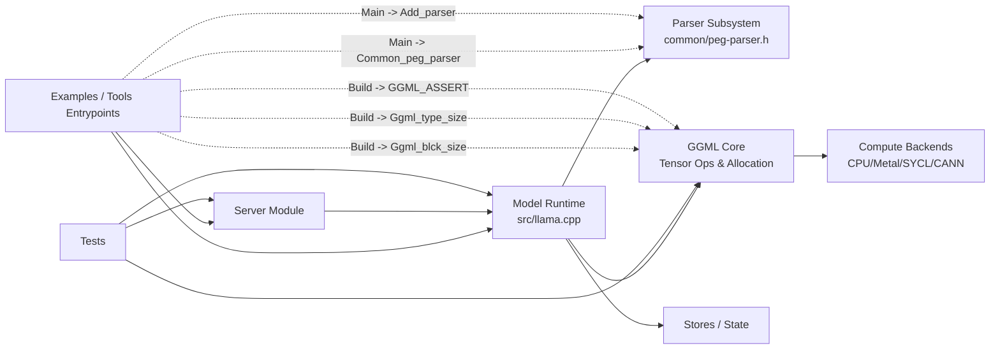

# llama.cpp Architecture Map

## Overview

GitNexus reports `llama.cpp` as a large multi-module system (`2548` files, `61693` symbols, `300` indexed execution processes).  
The architecture is centered on three connected concerns:
- front-end entrypoints (`examples/*`, `tools/*`) that drive model/runtime behavior,
- core model/runtime orchestration in `src/llama.cpp`,
- tensor/back-end primitives in `ggml/*`, with parser and utility subsystems in `common/*`.

## Functional Areas

From GitNexus cluster data (top modules by symbol volume/cohesion in shown set):
- **Tests** (`888`, cohesion `71%`): broad verification surface across subsystems.
- **Server** (`350`, `61%`): serving/runtime API layer for inference workflows.
- **Models** (`267`, `77%`): model-specific logic and loading behavior.
- **Ggml-cpu** (`303`, `55%`), **Ggml-metal** (`174`, `78%`), **Ggml-sycl** (`468`, `62%`), **Ggml-cann** (`226`, `62%`): compute back ends and tensor execution implementations.
- **Jinja** (`91`, `59%`) and **Htp** (`264`, `72%`): templating/protocol support around higher-level features.
- **Stores** (`192`, `85%`): high-cohesion state/storage-related functionality.

## Key Execution Flows

Top 5 processes selected from GitNexus process rankings and traces (prioritizing highest step count, repeated presence in the ranking list, and cross-community coverage):

1. **Main -> Common_peg_parser** (`10` steps, highest depth)  
   `examples/simple/simple.cpp` main path flows through model load/device prep into parser construction (`common_peg_parser`).

2. **Main -> Add_parser** (`9` steps, repeated in ranking)  
   `examples/simple-chat/simple-chat.cpp` startup path similarly reaches parser attachment (`add_parser`) after model/device orchestration.

3. **Build -> Ggml_blck_size** (`8` steps, foundational memory sizing primitive)  
   MTMD model build path (`tools/mtmd/models/mobilenetv5.cpp`) descends into ggml tensor sizing (`ggml_row_size` -> `ggml_blck_size`).

4. **Build -> Ggml_type_size** (`8` steps, shared with tensor allocation path)  
   Same build/unary/view/new tensor path terminating in type-size resolution (`ggml_type_size`), central for layout/footprint calculations.

5. **Build -> GGML_ASSERT** (`8` steps, core correctness guardrail)  
   Build path reaches low-level object creation and runtime invariants (`ggml_new_object` -> `GGML_ASSERT`), highlighting safety checks in core ggml execution.

## Mermaid Diagram

